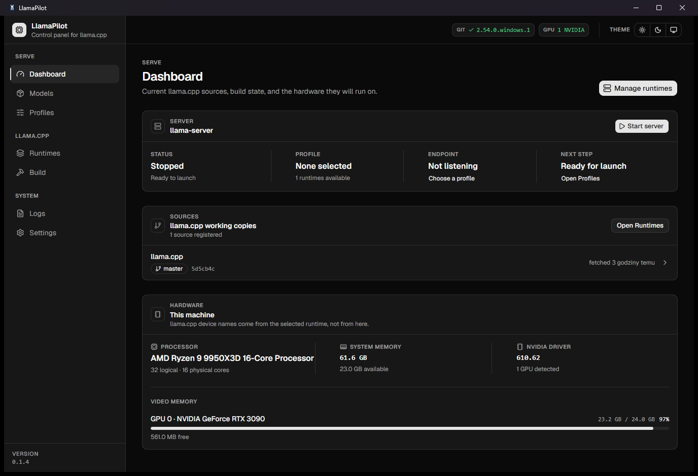
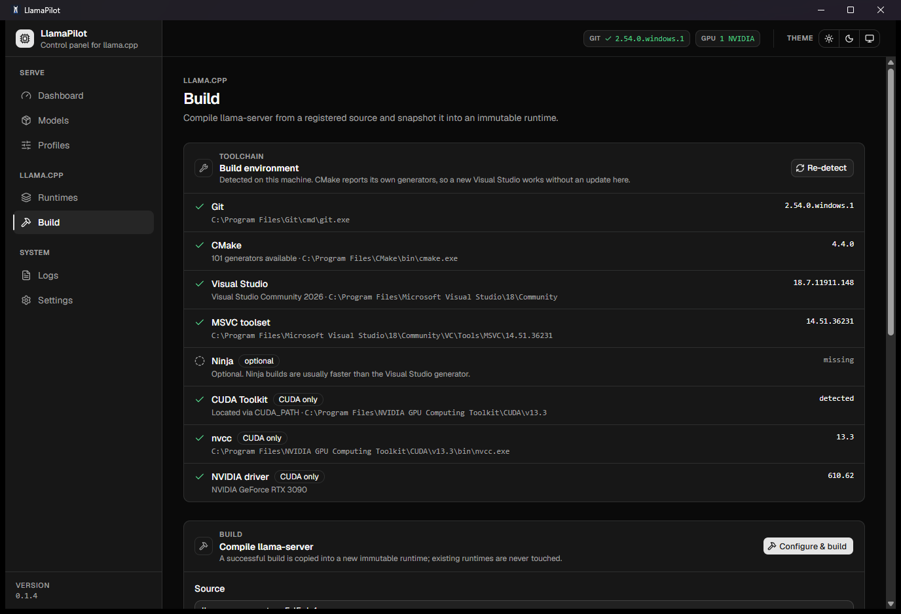
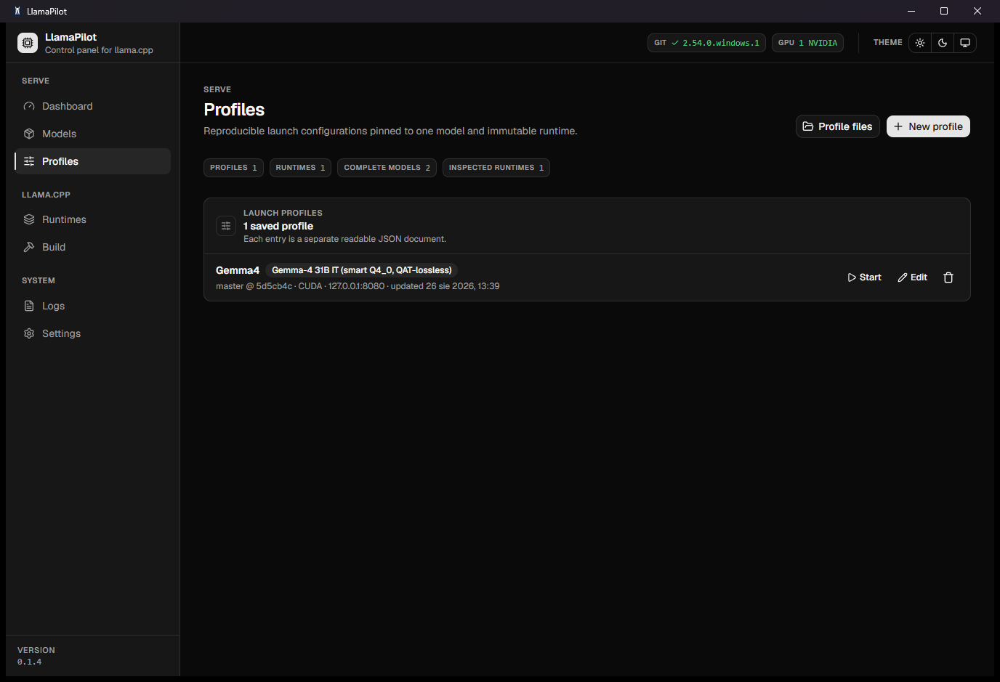

<p align="center">
  
</p>

<h1 align="center">LlamaPilot</h1>

<p align="center">
  Build, version, inspect, and run your own <code>llama.cpp</code> servers from one native Windows app.
</p>

<p align="center">
  
  
  
  
  
</p>

LlamaPilot is a Windows-first desktop control panel for upstream
[llama.cpp](https://github.com/ggml-org/llama.cpp). It manages the whole local serving workflow
without hiding the tools underneath: clone a source, build `llama-server`, keep immutable runtime
snapshots, discover what each binary supports, create launch profiles, and monitor the running
server.

It is deliberately **not a chat client** and **not another inference backend**. The process doing
the work is your own `llama-server.exe`, built from the source and revision you choose.

<p align="center">
  <a href="docs/images/dashboard.png">
    
  </a>
</p>

## Screenshots

| Build and version llama.cpp | Create precise launch profiles |
| --- | --- |
| [](docs/images/build.png) | [](docs/images/profiles.png) |

## Why LlamaPilot?

| Without it | With LlamaPilot |
| --- | --- |
| Long command lines copied between text files | Named, persistent launch profiles with exact previews |
| Rebuilding over the last working binary | Immutable runtime snapshots that safely coexist |
| Guessing whether a flag exists in your build | Controls generated from that binary's own `--help` output |
| Manual Git, CMake, CUDA, and model bookkeeping | One guided desktop workflow with actionable errors |
| A terminal full of mixed startup output | Searchable live logs, parsed facts, and untouched raw output |
| Orphaned compilers or servers after cancellation | Windows Job Objects terminate the complete process tree |

## Highlights

- **Own your runtime** — clone upstream llama.cpp or a fork, fetch remotes, switch branches, tags,
  and commits, and update with fast-forward-only safety.
- **Build without a developer prompt** — detect Visual Studio, CMake, Ninja, and CUDA; build CPU
  or CUDA profiles; retain live output; cancel the entire build tree safely.
- **Never lose a working build** — every successful build becomes a self-describing, immutable
  runtime containing the executable, required libraries, metadata, and capability manifest.
- **Use what the binary actually supports** — runtime controls come from `--version`, `--help`,
  and `--list-devices`, including unknown flags introduced by newer llama.cpp versions.
- **Understand large model folders quickly** — scan GGUF metadata without reading tensor payloads,
  group split models, cache results, and pair multimodal projectors conservatively.
- **Download the exact GGUF you choose** — browse a public Hugging Face model repository,
  select one file or a complete shard set, and save it into an already configured model folder
  with progress, cancellation, and an automatic catalog refresh.
- **Tune advanced serving setups** — configure KV cache types, GPU placement, tensor splits,
  Flash Attention, and runtime-advertised speculative decoding strategies with cross-field checks.
- **Measure one model across every GPU** — generate VRAM-weighted layer, row, and supported tensor
  candidates, apply one to a profile, and compare repeatable coding-prompt timings in Performance
  Lab.
- **Name models for API clients** — assign comma-separated aliases that coding agents and other
  OpenAI-compatible clients can use in their `model` field when the runtime supports `--alias`.
- **Connect a coding agent without guessing** — start a profile, verify `/v1/models` and
  `/v1/chat/completions`, then copy the effective URL, model ID, and ready configuration for
  OpenCode, Pi, Aider, or an OpenAI JavaScript client from Agent Connect.
- **Run and observe** — Start, Stop, and Restart from the Dashboard or Profiles page; readiness
  comes from `/health`, while `/props`, `/slots`, and `/metrics` enrich optional telemetry.
- **Keep the raw truth** — stdout and stderr are drained concurrently into a bounded live view and
  a per-run raw transcript. Parsed levels and startup facts never rewrite the original line.

## Quick start

### Install

Download the installer from the [latest LlamaPilot release](https://github.com/empios/LlamaPilot/releases/latest):

- `LlamaPilot_<version>_x64-setup.exe` — recommended interactive installer
- `LlamaPilot_<version>_x64_en-US.msi` — MSI package for managed environments

Packages are currently unsigned, so Microsoft Defender SmartScreen may show a warning. Verify that
the download comes from `github.com/empios/LlamaPilot/releases` before running it.

### First server

1. Open **Settings** and add one or more directories containing `.gguf` models.
2. Open **Runtimes** and clone upstream llama.cpp or register an existing working copy.
3. Open **Build**, choose CPU or CUDA, and build `llama-server`.
4. Inspect the new runtime so LlamaPilot can discover its exact command surface.
5. Open **Models**, verify the model and optional multimodal projector pairing. You can also choose
   **Hugging Face**, paste a public model repository URL or ID, and download an exact GGUF
   selection directly into one of the configured model folders.
6. Create a **Profile**, review the generated command, and press **Start**.
7. Watch readiness, slots, throughput, and untouched output on **Dashboard** and **Logs**.
8. Open **Performance** and run **Auto-tune** to test every runtime-valid GPU placement. LlamaPilot
   performs isolated model loads, saves the fastest successful generation configuration, and leaves
   the server stopped for review or launch.
9. Open **Agent Connect**, start the tuned profile, run the compatibility test, and copy the
   generated connection settings into the coding agent.

## Safety by design

- The WebView cannot run arbitrary commands. It can only call named Rust operations; the Tauri
  shell plugin is intentionally absent.
- Process arguments are arrays, never shell strings. User values cannot turn into shell syntax.
- Git operations never reset, force-checkout, or implicitly stash user work. Updates are
  fast-forward-only and dirty tracked files block destructive transitions.
- Builds publish transactionally. Failed or cancelled work never replaces an existing runtime.
- Environment overrides belong only to the launched child and never modify machine or user state.
- Exactly one server is supervised at a time, and an active profile or runtime cannot be deleted.
- Windows Job Objects use kill-on-close so app crashes cannot strand a server or build descendants.

## Technology

- **Desktop:** Tauri 2 and Rust on Tokio
- **UI:** React 19, TypeScript, Vite, Tailwind CSS, and Radix UI
- **State:** TanStack Query for backend state and Zustand for local UI state
- **Boundaries:** Serde on Rust and Zod validation in TypeScript
- **Integration:** Git, CMake, upstream llama.cpp CLI discovery, GGUF v2/v3 metadata, and the
  documented llama-server HTTP endpoints

The architecture keeps process execution and filesystem access in Rust. The frontend is a typed,
reactive control surface rather than a privileged shell.

## Build from source

### Requirements

- Windows 10 or 11 x64
- Node.js 20+
- Rust stable with the MSVC target
- Git
- Visual Studio 2022 with **Desktop development with C++** and CMake
- Optional: CUDA Toolkit for CUDA builds of llama.cpp

### Development

```powershell
git clone https://github.com/empios/LlamaPilot.git
cd LlamaPilot
npm install
npm run tauri dev
```

### Verification and installers

```powershell
npm run typecheck
npm test
npm run build

cd src-tauri
cargo fmt -- --check
cargo clippy --all-targets -- -D warnings
cargo test

cd ..
npm run tauri build
```

The final command creates both NSIS and MSI packages under
`src-tauri/target/release/bundle/`.

Version tags matching `v*` run the Windows release workflow, which builds both installers and
publishes them to GitHub Releases.

## Project status

The initial eight-phase implementation roadmap is complete:

1. Native shell, settings, typed IPC, and structured errors
2. Safe llama.cpp source and remote management
3. Toolchain detection, builds, cancellation, and immutable runtimes
4. Runtime-specific capability discovery
5. GGUF catalog, split grouping, and multimodal projector pairing
6. Persistent launch profiles and exact command previews
7. Advanced memory, multi-GPU, and speculative decoding controls
8. Server supervision, health telemetry, and live/raw logs

The current optimization track is focused on one coding-model server using all available GPUs.
Performance Lab is the measurement foundation: it creates capability-aware placement candidates,
records prompt and generation throughput, and keeps results tied to the exact profile, runtime,
model, and GPU snapshot. Its automatic sweep tests each candidate under the same deterministic
request, skips unsupported placements, and applies the fastest successful generation result without
weakening the single-server safety model.

The current version is an early release focused on a trustworthy local llama.cpp workflow.
Bug reports and focused pull requests are welcome.

## Documentation

- [Architecture](docs/ARCHITECTURE.md) — modules, state ownership, persistence, errors, and safety
  invariants
- [llama.cpp integration](docs/LLAMA_INTEGRATION.md) — verified upstream behavior behind sources,
  builds, GGUF handling, command generation, health checks, and logs
- [Release process](docs/RELEASING.md) — versioning, verification, tagging, and installer publishing

See [CONTRIBUTING.md](CONTRIBUTING.md) for the development workflow and [SECURITY.md](SECURITY.md)
for responsible vulnerability reporting.

## License

[MIT](LICENSE) — use it, study it, adapt it, and contribute improvements back if you can.
